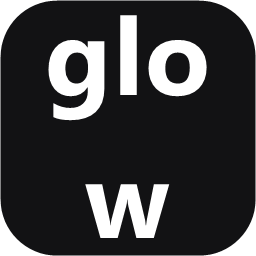

<div align="center">



# Glow

**Лёгкая утилита в трее для управления аппаратной яркостью мониторов через DDC/CI.**

[](https://github.com/Yadek/glow/actions/workflows/build.yml)
[](https://github.com/Yadek/glow/releases/latest)
[](https://www.microsoft.com/windows)
[](https://dotnet.microsoft.com/)
[](LICENSE)

[English](README.md) · **Русский**

</div>

---

## Возможности

- **Настоящая аппаратная яркость** — управляет внешними мониторами по **DDC/CI** (`Dxva2.dll`), а не программным затемнением.
- **Мультимониторность** — сам находит все подключённые экраны и показывает отдельный ползунок для каждого, подписанный реальной моделью (читается из EDID).
- **Ночной свет** — тёплый фильтр экрана с тумблером и регулировкой интенсивности; применяется ко всем мониторам и сбрасывается при выходе.
- **Почти нулевой расход ресурсов** — никаких фоновых таймеров и опроса; программа спит в цикле сообщений и просыпается только по клику. CPU в простое ≈ 0%.
- **Один автономный `.exe`** — без установки среды .NET.
- **Авто-локализация** — язык интерфейса следует за языком Windows (English / Русский), фоллбек на английский.
- **Под тему системы** — ползунок использует текущий акцентный цвет Windows.
- **Тихая автозагрузка** — по желанию запуск вместе с Windows через `HKCU\…\Run`.
- **Автообновление** — проверяет GitHub Releases и обновляется с твоего подтверждения.
- **Чистое удаление** — убирает приложение, ключ автозагрузки и все настройки; следов не остаётся.

## Как работает

Кликните по иконке **Glow** в системном трее (рядом с иконкой звука) → появится небольшое окно с ползунком яркости на каждый монитор. Тяните — изменение сразу пишется в железо. Правый клик по иконке — **Запуск при старте Windows** и **Выход**.

> DDC/CI должен поддерживаться и быть включён на мониторе. Большинство внешних настольных мониторов его поддерживают; многие встроенные матрицы ноутбуков — нет (такие просто пропускаются).

## Установка

1. Скачайте `Glow-Setup-x.y.z.exe` из [последнего релиза](https://github.com/Yadek/glow/releases/latest).
2. Запустите и отметьте **Запускать Glow автоматически при старте Windows**.
3. Glow появится в трее. Готово.

Не нужен установщик? Возьмите `Glow-x.y.z-portable.exe` из того же релиза и запускайте напрямую — он полностью автономный.

## Технологии

| Область         | Решение                                             |
| --------------- | --------------------------------------------------- |
| Язык            | C# / .NET 8                                          |
| Интерфейс       | WinForms — окно без рамки, отрисованное вручную      |
| API яркости     | Win32 DDC/CI через P/Invoke (`Dxva2.dll`)           |
| Имена мониторов | EDID из реестра (без WMI)                            |
| Упаковка        | Автономный single-file exe                           |
| Установщик      | Inno Setup 6                                         |
| CI/CD           | GitHub Actions → сборка, упаковка, публикация релиза |

## Сборка из исходников

Нужен **.NET 8 SDK** и, для установщика, **Inno Setup 6**.

```powershell
# Сборка автономного single-file exe
dotnet publish src/Glow/Glow.csproj -c Release -r win-x64 `
  --self-contained true -p:PublishSingleFile=true -o publish

# Сборка установщика
& "C:\Program Files (x86)\Inno Setup 6\ISCC.exe" installer\glow.iss `
  "/DSourceExe=$PWD\publish\Glow.exe"
# -> installer\Output\Glow-Setup-1.0.0.exe
```

Иконка в трее рисуется в рантайме; иконка `.exe` (`src/Glow/glow.ico`) лежит в репозитории и пересоздаётся из логотипа через `tools/Make-Icon.ps1`.

## Релизы

Запушьте тег с версией — CI соберёт exe, упакует установщик и приложит оба файла к новому релизу на GitHub:

```bash
git tag v1.0.0
git push origin v1.0.0
```

## Структура репозитория

```
glow/
├─ src/Glow/            # исходный код
│  ├─ Native/           # Win32 / DDC-CI P/Invoke
│  ├─ Monitors/         # поиск мониторов, имена, яркость
│  ├─ Localization/     # строки EN/RU
│  ├─ Startup/          # переключатель автозагрузки (HKCU)
│  ├─ UI/               # иконка трея, окно, ползунок, тема
│  └─ glow.ico
├─ installer/glow.iss   # скрипт Inno Setup
├─ tools/Make-Icon.ps1  # генератор иконки
├─ assets/glow.svg      # исходный логотип
└─ .github/workflows/   # CI/CD
```

## Лицензия

[MIT](LICENSE)
