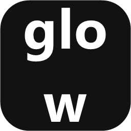

<div align="center">



# Glow

**Лёгкая утилита в трее для аппаратной яркости мониторов по DDC/CI — с ночным режимом на каждый монитор отдельно или сразу на все.**

[](https://github.com/Yadek/glow/actions/workflows/build.yml)
[](https://github.com/Yadek/glow/releases/latest)
[](https://www.microsoft.com/windows)
[](https://dotnet.microsoft.com/)
[](LICENSE)

[English](README.md) · **Русский**

</div>

---

## Возможности

- **Настоящая аппаратная яркость** — управляет внешними мониторами по **DDC/CI** (`Dxva2.dll`), а не программным затемнением.
- **Мультимониторность** — сам находит все подключённые экраны и показывает отдельный ползунок для каждого, подписанный реальной моделью (читается из EDID).
- **Ночной режим на каждый монитор** — своя теплота для каждого экрана **или** сразу для всех из карточки *Все мониторы*. Работает даже на экранах без DDC/CI, потому что идёт через гамма-рампы, а не через цветовые настройки самого монитора.
- **Настройки не теряются** — ночной режим сохраняется по EDID-идентификатору экрана, поэтому переживает перезагрузку и «переезжает» вместе с монитором на другой порт. Автоматически применяется заново после сна, смены разрешения или разблокировки — там, где Windows молча сбрасывает гамму.
- **Почти нулевой расход ресурсов** — никаких фоновых таймеров и опроса; программа спит в цикле сообщений и просыпается только по клику. CPU в простое ≈ 0%.
- **Один автономный `.exe`** — без установки среды .NET.
- **Авто-локализация** — язык интерфейса следует за языком Windows (English / Русский), фоллбек на английский.
- **Под тему системы** — следует за светлой/тёмной темой Windows и акцентным цветом, со скруглёнными углами Windows 11.
- **Тихая автозагрузка** — по желанию запуск вместе с Windows через `HKCU\…\Run`.
- **Автообновление** — проверяет GitHub Releases и обновляется с твоего подтверждения. Беты не предлагает.
- **Чистое удаление** — убирает приложение, ключ автозагрузки и все настройки; следов не остаётся.

## Как работает

Кликните по иконке **Glow** в системном трее (рядом с иконкой звука) → появится окно с карточкой **Все мониторы**, которая управляет сразу всеми экранами. Нажмите **Каждый монитор отдельно** — раскроется по карточке на монитор, повторное нажатие свернёт обратно; окно запоминает, как вы его оставили.

В каждой карточке есть **строка с солнцем** (аппаратная яркость по DDC/CI) и **строка с луной** (ночной режим). Общие ползунки держат то значение, которое *вы* им задали: настройка отдельного экрана их не сдвигает, поэтому общий ползунок остаётся тем, что вы выставляете, а не бегущим средним. Его переключатель показывает *Разное*, когда состояние экранов не совпадает.

Правый клик по иконке — **Ночной режим на всех мониторах**, **Запуск при старте Windows** и **Выход**. Клик средней кнопкой переключает ночной режим везде, не открывая окно.

> **Яркость** требует поддержки и включённого DDC/CI на мониторе. Большинство внешних настольных мониторов его поддерживают; многие встроенные матрицы ноутбуков — нет; такие экраны всё равно получают карточку, но только с ночным режимом.
>
> **Ночной режим** управляет гаммой экрана, поэтому конкурирует с функцией *Ночной свет* в Windows: побеждает тот, кто записал последним. Если пользуетесь режимом Glow — выключите системный. Также он не действует на экране в режиме HDR, который гамма-рампы игнорирует полностью.

## Установка

1. Скачайте `Glow-Setup-x.y.z.exe` из [последнего релиза](https://github.com/Yadek/glow/releases/latest).
2. Запустите и отметьте **Запускать Glow автоматически при старте Windows**.
3. Glow появится в трее. Готово.

Не нужен установщик? Возьмите `Glow-x.y.z-portable.exe` из того же релиза и запускайте напрямую — он полностью автономный.

### Бета-сборки

Версии с суффиксом `-beta` публикуются как **предрелизы** GitHub, и качать их нужно прямо со [страницы релизов](https://github.com/Yadek/glow/releases) — ссылка «последний релиз» выше всегда ведёт на свежую стабильную сборку.

Бета-сборки **никогда не проверяют обновления сами**, чтобы не отвлекать во время тестирования; пункт **Проверить обновления** в меню трея по-прежнему работает по запросу. Стабильным установкам бета тоже не предлагается: проверка смотрит только на последний *стабильный* релиз.

## Технологии

| Область         | Решение                                             |
| --------------- | --------------------------------------------------- |
| Язык            | C# / .NET 8                                          |
| Интерфейс       | WinForms — окно без рамки, отрисованное вручную      |
| API яркости     | Win32 DDC/CI через P/Invoke (`Dxva2.dll`)           |
| Ночной режим    | Гамма-рампы на каждый экран (`gdi32.dll`)           |
| Имена мониторов | EDID из реестра (без WMI)                            |
| Упаковка        | Автономный single-file exe                           |
| Установщик      | Inno Setup 6                                         |
| CI/CD           | GitHub Actions → сборка, упаковка, публикация релиза |

## Сборка из исходников

Нужен **.NET 8 SDK** и, для установщика, **Inno Setup 6**.

```powershell
# Сборка автономного single-file exe
dotnet publish src/Glow/Glow.csproj -c Release -r win-x64 `
  --self-contained true -p:PublishSingleFile=true -o publish

# Сборка установщика
& "C:\Program Files (x86)\Inno Setup 6\ISCC.exe" installer\glow.iss `
  "/DSourceExe=$PWD\publish\Glow.exe"
# -> installer\Output\Glow-Setup-1.0.0.exe
```

Иконка в трее рисуется в рантайме; иконка `.exe` (`src/Glow/glow.ico`) лежит в репозитории и пересоздаётся из логотипа через `tools/Make-Icon.ps1`.

## Релизы

Запушьте тег с версией — CI соберёт exe, упакует установщик и приложит оба файла к новому релизу на GitHub:

```bash
git tag v1.0.0
git push origin v1.0.0
```

## Структура репозитория

```
glow/
├─ src/Glow/            # исходный код
│  ├─ Native/           # Win32 / DDC-CI / гамма / DPI P/Invoke
│  ├─ Monitors/         # поиск экранов, имена из EDID, яркость по DDC
│  ├─ NightShift/       # ночной режим на каждый экран (гамма-рампы)
│  ├─ Settings/         # настройки в HKCU, включая состояние экранов
│  ├─ Localization/     # строки EN/RU
│  ├─ Startup/          # переключатель автозагрузки (HKCU)
│  ├─ Update/           # проверка релизов GitHub (в бете — только вручную)
│  ├─ UI/               # иконка трея, окно, ползунок, глифы, тема
│  └─ glow.ico
├─ installer/glow.iss   # скрипт Inno Setup
├─ tools/Make-Icon.ps1  # генератор иконки
├─ assets/glow.svg      # исходный логотип
└─ .github/workflows/   # CI/CD
```

## Лицензия

[MIT](LICENSE)
